> 主要来源： [UML图中类之间的关系:依赖,泛化,关联,聚合,组合,实现](http://www.cnblogs.com/LUO77/p/5785374.html)
> 参考：[详解UML图之类图](详解UML图之类图)

### 依赖关系（Dependence）

假设A类的变化引起了B类的变化，则说名B类依赖于A类。

依赖关系(Dependency) 是一种使用关系，特定事物的改变有可能会影响到使用该事物的其他事物，在需要表示一个事物使用另一个事物时使用依赖关系。大多数情况下，依赖关系体现在某个类的方法使用另一个类的对象作为参数。尽量不使用双向的互相依赖。

在UML中，依赖关系用带箭头的虚线表示，由依赖的一方指向被依赖的一方。


依赖关系有如下三种情况：
1、A类是B类中的（某中方法的）局部变量；
2、A类是B类方法当中的一个参数；
3、A类向B类发送消息，从而影响B类发生变化；

### 泛化关系（Generalization）

A是B和C的父类，B,C具有公共类（父类）A，说明A是B,C的一般化（概括，也称泛化）

泛化关系(Generalization)也就是继承关系，也称为“is-a-kind-of”关系，泛化关系用于描述父类与子类之间的关系，父类又称作基类或超类，子类又称作派生类。在UML中，泛化关系用带空心三角形的直线来表示。

在代码实现时，使用面向对象的继承机制来实现泛化关系，如在Java语言中使用extends关键字、在C++/C#中使用冒号“：”来实现。 


在UML当中，对泛化关系有三个要求：
1、子类与父类应该完全一致，父类所具有的属性、操作，子类应该都有；
2、子类中除了与父类一致的信息以外，还包括额外的信息；
3、可以使用父类的实例的地方，也可以使用子类的实例；

### 关联关系（Association）

类之间的联系，如客户和订单，每个订单对应特定的客户，每个客户对应一些特定的订单，再如篮球队员与球队之间的关联（下图所示）。


其中，关联两边的"employee"和“employer”标示了两者之间的关系，而数字表示两者的关系的限制，是关联两者之间的多重性。通常有“*”（表示所有，不限），“1”（表示有且仅有一个），“0...”（表示0个或者多个），“0，1”（表示0个或者一个），“n...m”(表示n到m个都可以),“m...*”（表示至少m个）。

关联关系(Association)是类与类之间最常用的一种关系，它是一种结构化关系，用于表示一类对象与另一类对象之间有联系。

在UML类图中，用实线连接有关联的对象所对应的类，在使用Java、C#和C++等编程语言实现关联关系时，通常将一个类的对象作为另一个类的属性。

在使用类图表示关联关系时可以在关联线上标注角色名。

1)  双向关联: 默认情况下，关联是双向的。


2 ) 单向关联:类的关联关系也可以是单向的，单向关联用带箭头的实线表示.


3) 自关联: 在系统中可能会存在一些类的属性对象类型为该类本身，这种特殊的关联关系称为自关联。


4) 重数性关联: 重数性关联关系又称为多重性关联关系(Multiplicity)，表示一个类的对象与另一个类的对象连接的个数。在UML中多重性关系可以直接在关联直线上增加一个数字表示与之对应的另一个类的对象的个数。


### 聚合关系（Aggregation）

表示的是整体和部分的关系，整体与部分 可以分开.

聚合关系(Aggregation) 表示一个整体与部分的关系。通常在定义一个整体类后，再去分析这个整体类的组成结构，从而找出一些成员类，该整体类和成员类之间就形成了聚合关系。

在聚合关系中，成员类是整体类的一部分，即成员对象是整体对象的一部分，但是成员对象可以脱离整体对象独立存在。在UML中，聚合关系用带空心菱形的直线表示。 


如：电话机包括一个话筒

电脑包括键盘、显示器，一台电脑可以和多个键盘、多个显示器搭配，确定键盘和显示器是可以和主机分开的，主机可以选择其他的键盘、显示器组成电脑；


### 组合关系（Composition）

也是整体与部分的关系，但是整体与部分不可以分开。

组合关系(Composition)也表示类之间整体和部分的关系，但是组合关系中部分和整体具有统一的生存期。一旦整体对象不存在，部分对象也将不存在，部分对象与整体对象之间具有同生共死的关系。

在组合关系中，成员类是整体类的一部分，而且整体类可以控制成员类的生命周期，即成员类的存在依赖于整体类。在UML中，组合关系用带实心菱形的直线表示。


如：公司和部门，部门是部分，公司是整体，公司A的财务部不可能和公司B的财务部对换，就是说，公司A不能和自己的财务部分开； 人与人的心脏.


### 实现关系（Implementation）

是用来规定接口和实线接口的类或者构建结构的关系，接口是操作的集合，而这些操作就用于规定类或者构建的一种服务。 

接口之间也可以有与类之间关系类似的继承关系和依赖关系，但是接口和类之间还存在一种实现关系(Realization)，在这种关系中，类实现了接口，类中的操作实现了接口中所声明的操作。在UML中，类与接口之间的实现关系用带空心三角形的虚线来表示。


### 使用 PlantUML 画 UML 类图

1. 安装 graphviz-2.38.msi
2. 下载 plantuml.jar
3. 运行：`java -jar plantuml.jar test.puml`

```uml
@startuml
(*)  --> "check input"
If "input is verbose" then
--> [Yes] "turn on verbosity"
--> "run command"
else
--> "run command"
Endif
-->(*)
@enduml
```

生成的png


#### 时序图

1. 基本用法

seq.puml 

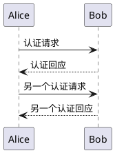


注意：windows系统seq.puml应设置为gb2312编码来防止中文乱码。

2. 定义参与者

- 可以使用 participant 关键字来定义参与者顺序
- 可以用其他关键词来定义一个参与者

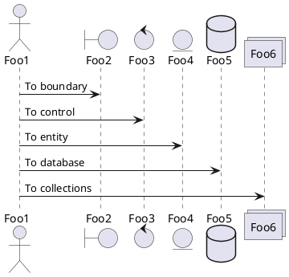


- 可以通过 as 关键字来重命名一个参与者
- 可以改变参与者的背景色

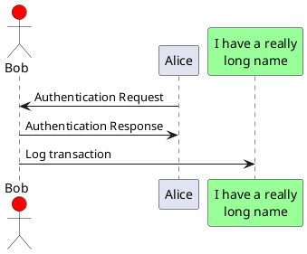


- 可以通过 order 关键字来自定义参与者显示顺序

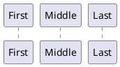


- 使用非字母参与者

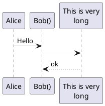


3. 参与者可以给自己发消息

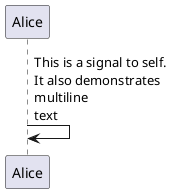


4. 改变箭头样式

- add a final x to denote a lost message
- use \ or / instead of < or > to have only the bottom or top part of the arrow
- repeat the arrow head (for example, >> or //) head to have a thin drawing
- use -- instead of - to have a dotted arrow
- add a final ”o” at arrow head
- use bidirectional arrow


5. 改变箭头颜色

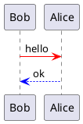


6. 自动给消息添加序列号

使用关键字 autonumber 

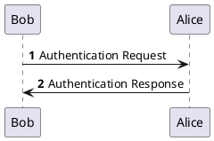


You can specify a startnumber with autonumber 'start' , and also an increment with autonumber
'start' 'increment'.

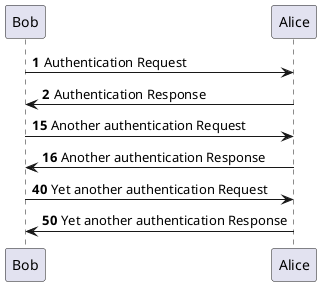


7. 图分割

使用 newpage 关键字可以将图片分割成多个

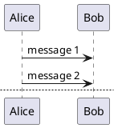


8. 消息分组

It is possible to group messages together using the following keywords:

- alt/else
- opt
- loop
- par
- break
- critical
- group, followed by a text to be displayed

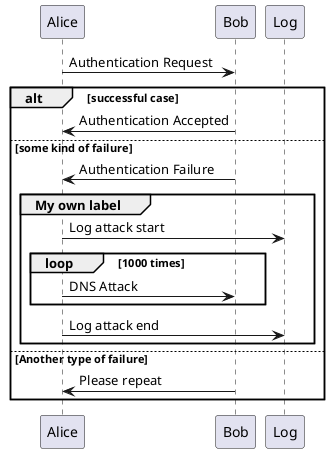


9. 消息备注

使用 note left 或者 note right 关键字

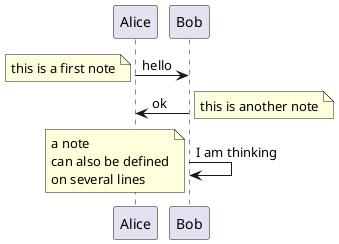


It is possible to highlight a note by changing its background color.
You can also have a multi-line note using the end note keywords.

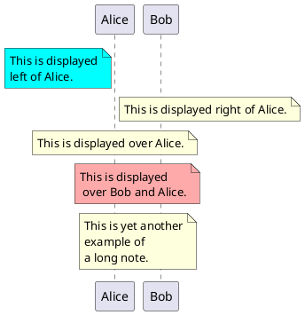


10. 分割线

If you want, you can split a diagram using == separator to divide your diagram into logical steps.

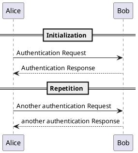


11. 介绍

使用 ref over 关键字

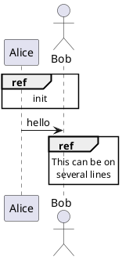


12. 延迟

使用符号 `...` 作为关键字

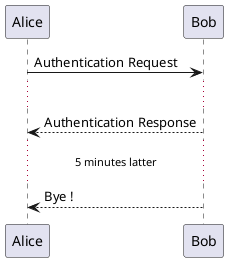


13. 空白

使用 `|||` 代表空白，可以得到一定的空间。

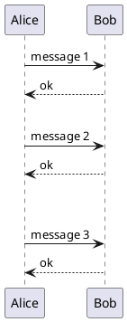


